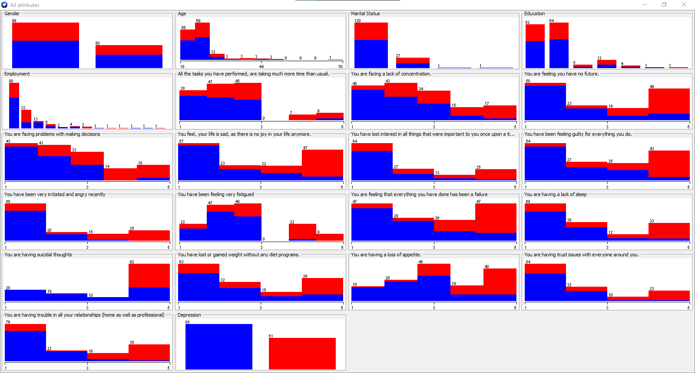

# Viusalization & Plots

## 1. All Attribute w.r.t Depression

## 2. K-Means Clustering

### 2.1 Gender VS Depression

### 2.2 Age VS Depression

### 2.3 Marital Status VS Depression

### 2.4 Education VS Depression

### 2.5 Employment VS Depression

### 2.6 Clusters VS Depression

