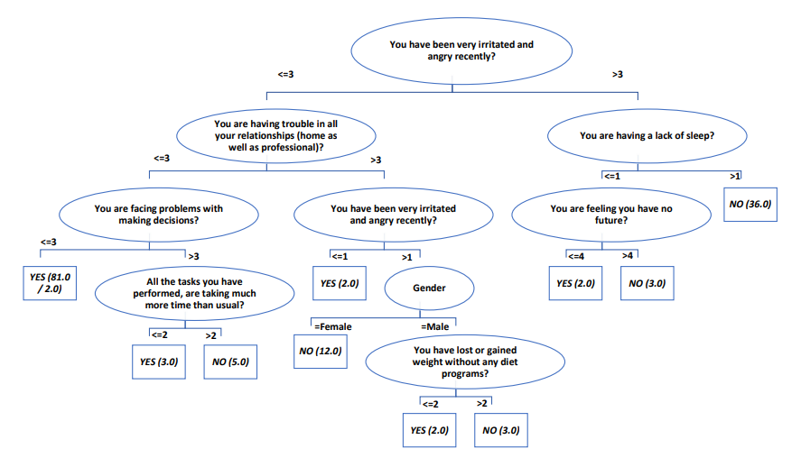

# Viusalization & Plots

## 1. All Attribute w.r.t Depression

## 2. Decision Tree Classifier

## 3. K-Means Clustering

### 3.1 Gender VS Depression

### 3.2 Age VS Depression

### 3.3 Marital Status VS Depression

### 3.4 Education VS Depression

### 3.5 Employment VS Depression

### 3.6 Clusters VS Depression

## 4. Plot Matrix

